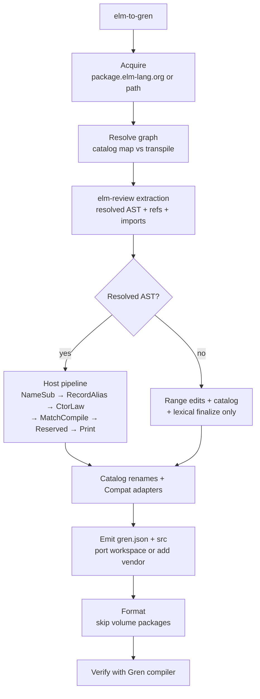

# Grenity

`elm-to-gren` — Gren-native CLI that ports an Elm package (and its dependency
graph) into compiler-validated Gren packages.

Always formats (volume packages auto-skip) and always verifies with the Gren
compiler. One List/Tuple strategy: Gren Array + records (no shim mode).

```sh
npm install && npm run build
node bin/elm-to-gren.cjs elm-community/list-extra --out ./out --cache ./cache
```

Vendor into an existing Gren **application** (`gren.json` type `application`):

```sh
# from the app root
node bin/elm-to-gren.cjs add elm-community/list-extra --cache ./cache
# → ./.elm-to-gren/packages/<author>_<name>__<version>/
# → gren.json direct: "local:.elm-to-gren/packages/..."
# modules get an Elm. prefix
```

## Commands

```
elm-to-gren [port] <author/package[@version] | local-path> [options]
elm-to-gren add    <author/package[@version] | local-path> [options]
```

| Command | Role |
| --- | --- |
| `port` (default) | Fresh workspace (`--out`, default `./gren-output`). Modules unprefixed. |
| `add` | Vendor into app root (`--out`, default `.`). Modules **`Elm.`-prefixed**. Idempotent. |

### Options

| Flag | Meaning |
| --- | --- |
| `-o, --out <dir>` | Workspace (`port`) or app root (`add`) |
| `--cache <dir>` | Download / analysis cache (default: `~/.cache/elm-to-gren`) |
| `--platform <p>` | `auto` (default), `common`, `browser`, or `node` |
| `--mapping <file>` | Extra/override mappings; repeatable |
| `--offline` | Registry/cache only |
| `--json` | Machine-readable report |
| `-h, --help` / `-v, --version` | Help / version |

`add` maps known registry packages into the app’s `dependencies.indirect` where
applicable; the ported library is `dependencies.direct` as
`local:.elm-to-gren/packages/<author>_<pkg>__<ver>`.

## How it works



1. **Acquire** package + recursive deps (catalog hits map to Gren packages; rest transpile).
2. **Analyze** with a custom elm-review rule: resolved simplified AST when available, plus refs/imports.
3. **Transform** (AST path, host-owned):
   `NameSub → RecordAlias → CtorLaw → MatchCompile → Reserved → Print`.
   Then catalog renames (`List.filter` → `Array.keepIf`, …) and `ElmToGren.Compat.*`.
   No AST → range edits + catalog + lexical only.
4. **Emit** workspace (`port`) or `.elm-to-gren/packages/` + `gren.json` (`add`).
5. **Format** with vendored [gilramir/gren-format](https://github.com/gilramir/gren-format)
   unless **volume** (any of: ≥200 modules, ≥400KB total, ≥100KB single module).
   Volume skip also skips record-pattern collapse.
6. **Verify** with the real Gren binary:
   - applications: `gren make Main --output=/dev/null`
   - packages: try `gren make Main`; on non-zero, `gren docs --output=/dev/null`

### What ports / what does not

Supported target: pure (and browser) libraries over `elm/core` and common
companions (`json`, `time`, `random`, `bytes`, `regex`, `url`, `parser`, …).
Unknown deps are transpiled recursively. Catalog packages are not re-ported.

**Hard-refused** (acquisition):

- `effect module`
- `Elm.Kernel` / Native kernel imports
- GLSL blocks (`[glsl|…|]`)

**Kept:** `port module` / `port` **syntax** is preserved for app interop. The
tool does **not** emit the JS/kernel half of ports; wire that in the Gren app
as you would any other port surface.

**Keywords:** binders/uses of `when` / `is` → `when_` / `is_`.

**Host laws** (generic): list peels → nested `Array.popFirst`; multi-arg ctors
→ single record payload; record type-alias ctors; reserved renames;
import-alias / qualified-name hygiene. Some unreachable fallthroughs are
`Debug.todo "elm-to-gren: …"`.

Unmapped APIs in mapped packages still emit; Gren then fails at verify. Fix the
catalog or a Compat helper, not one hand-edited package.

```elm
List.filter (\n -> n > 0) numbers
```

```gren
Array.keepIf (\n -> n > 0) numbers
```

## Ecosystem smoke tests

Phase notes: [`docs/PHASE-ECOSYSTEM-HARDENING.md`](docs/PHASE-ECOSYSTEM-HARDENING.md).

Catalogs are **candidates**, not success counts. Only a **full unfiltered** suite
run writes commit-stamped proof to `.test-cache/ecosystem-proof/LAST_RUN.json`.
Canary/residual/filtered runs write triage only.

| Catalog | Role | Size |
| --- | --- | --- |
| `test/ecosystem/packages.json` | pure candidates | 200 |
| `test/ecosystem/packages-browser.json` | browser candidates | 252 |
| `test/ecosystem/packages-canary.json` | fast regression | 14 |

```sh
npm run ecosystem:status        # proof for HEAD (or NO/STALE)
npm run dev:loop                # build + unit + canary -j4
npm run ecosystem:canary        # 14-pkg canary (triage, not proof)
npm run ecosystem:residual      # re-port last failures (triage)
npm run ecosystem:pure:j        # full pure -j6 (proof)
npm run ecosystem:browser:j     # full browser -j6 (proof)
npm run test:ecosystem          # full pure serial (proof)
npm run test:ecosystem-browser  # full browser serial (proof)
```

Suite flags (after `--`): `--limit`, `--offset`, `--only a@v,b@v`,
`-j` / `--concurrency`, `--timeout-ms`, `--no-adaptive-timeout`,
`--fail-fast`, `--keep-out`, `--no-proof`.

Volume packages get **adaptive** per-package timeouts; budget exceedance is
classified **`scale`**, not hang/`timeout`, when the package is volume-sized.

## Development

```sh
npm run build
npm run check
npm test
npm run test:all                # check, unit, rule, format, e2e, both ecosystems
```

| Path | Role |
| --- | --- |
| `src/` | Gren CLI (acquire, resolve, transform, emit, format, verify) |
| `review/` | elm-review extractor (AST, refs, imports) |
| `mappings/builtin.json` | Elm→Gren package/API catalog |
| `tools/gren-format/` | vendored formatter (+ `collapse-record-patterns.cjs`) |
| `test/` | unit, format, e2e, ecosystem |
| `scripts/temp/` | disposable; never suite proof |

## License

MIT
