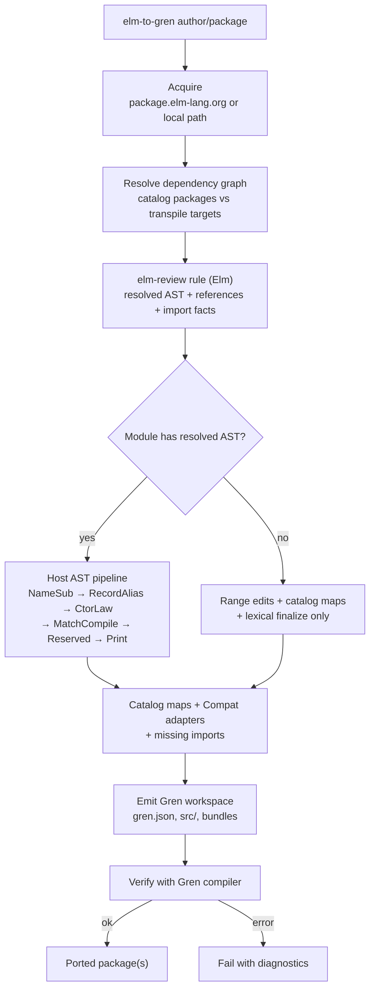

# Grenity

`elm-to-gren` — a Gren-native CLI that ports an Elm package and its whole
dependency graph into compiler-validated [Gren](https://gren-lang.org) packages.

Point it at an Elm package, get an installable Gren workspace back:

```sh
npm install
npm run build
node bin/elm-to-gren.cjs elm-community/list-extra --out ./out --cache ./cache
cd out && gren docs   # the output compiles with the official Gren compiler
```

Or vendor a package into an existing Gren application:

```sh
# from a Gren app root (must have gren.json with type "application")
node bin/elm-to-gren.cjs add elm-community/list-extra --cache ./cache
# writes ./.elm-to-gren/packages/... and adds a local dependency to gren.json
```

## Commands

```
elm-to-gren <author/package[@version] | local-path> [options]
elm-to-gren port <author/package[@version] | local-path> [options]
elm-to-gren add  <author/package[@version] | local-path> [options]
```

| Command | Purpose |
| --- | --- |
| `port` (default) | Port into a fresh Gren workspace (`--out`, default `./gren-output`). |
| `add` | Vendor into the current Gren app: source under `./.elm-to-gren/packages/`, local dep in `./gren.json`. `--out` is the project root (default `.`). |

### Options

| Flag | Meaning |
| --- | --- |
| `-o, --out <dir>` | Workspace (`port`) or project root (`add`) |
| `--cache <dir>` | Download and analysis cache |
| `--platform <p>` | `auto`, `common`, `browser`, or `node` (default `auto`) |
| `--namespace <author>` | Namespace generated package names |
| `--elm-namespace` | Prefix ported modules with `Elm.` (default for `add`) |
| `--no-elm-namespace` | Do not prefix modules (default for `port`) |
| `--mapping <file>` | Add or override mappings; may be repeated |
| `--offline` | Use cached registry data only |
| `--no-verify` | Skip the final Gren compiler check |
| `--json` | Print the final report as JSON |

`add` requires an application `gren.json` (not a package). It is idempotent:
re-running overwrites the vendored packages and updates the same dependency
entry. Mapped registry deps land in the app's `dependencies.indirect`; the
library itself is added under `dependencies.direct` as
`local:.elm-to-gren/packages/<name>-<version>`.

With `--elm-namespace` (on by default for `add`), module paths, declarations,
imports, and exposed names get an `Elm.` prefix so vendored APIs do not collide
with Gren-native modules.

## How it works



1. **Acquire** the Elm package and resolve its dependency graph
   (package.elm-lang.org or a local path).
2. **Analyze** every module with a custom [elm-review](https://package.elm-lang.org/packages/jfmengels/elm-review/latest/)
   rule that encodes a **resolved simplified AST** (when available), plus resolved
   value/type references and imports. List/cons totalization and multi-arg ctor
   lowers are **host-owned** (`Ast.MatchCompile`, `Ast.CtorLaw`, `Ast.RecordAlias`),
   not Rule exception hunting.
3. **Transform** on the host when AST is present:
   `NameSub` → `RecordAlias` → `CtorLaw` → `MatchCompile` → `Reserved` → `Print`.
   Catalog renames (`List.filter`→`Array.keepIf`, etc.) and `ElmToGren.Compat.*`
   adapters fill API gaps. Extractions without AST still use range edits only.
4. **Emit** Gren manifests, sources, and package bundles atomically
   (`port`), or vendor under `.elm-to-gren/packages/` and update the app
   `gren.json` (`add`).
5. **Format** every package with the vendored [gilramir/gren-format](https://github.com/gilramir/gren-format)
   tool (community reimplementation of official `gren format`, removed in 0.5).
6. **Verify** with the real Gren compiler (`gren docs`) before finishing
   (skipped with `--no-verify`).

## What ports

Pure library packages over `elm/core` (plus `elm/json`, `elm/time`,
`elm/random`, `elm/bytes`, `elm/regex`, `elm/url`, `elm/parser`) are the
supported path — `elm-community/list-extra` and `rtfeldman/elm-hex` are the
reference targets. Unknown dependencies are transpiled recursively.

Refused with a diagnostic (no portable translation exists):

- port modules and port declarations
- effect modules and `Elm.Kernel` / `Native` code
- GLSL shader expressions

Identifiers named `when` or `is` (Gren keywords; Elm's `case`/`of`) are
rewritten to `when_` / `is_` at every binding and use site.

**Gren kernel laws** (host AST, generic):

- **List peels:** `x :: xs` / fixed lists → nested `Array.popFirst` with binders
  in patterns; scope-aware α-rename (no shadowing); fallthrough as shared lets
- **Multi-arg ctors:** type/payload as one record; bare ctors η-expanded for
  `Parser.succeed Ctor`
- **Record type-alias ctors:** `Iso f g` → `{ get = f, reverseGet = g }`
- **Names:** import aliases (`Json.Decode`→`Decode`); `Dict.Dict` not bare
  `Dict` when that would collide or fail under `import Dict`

If an Elm function is in a mapped package (like `elm/core`) but we never taught
the tool its Gren name, the port still runs and then fails when Gren compiles
the result. Fix that by adding a mapping or a small compatibility helper, not
by editing the generated package by hand.

Example: Elm `List.filter` is mapped to Gren `Array.keepIf`, so this:

```elm
List.filter (\n -> n > 0) numbers
```

becomes something Gren accepts:

```gren
Array.keepIf (\n -> n > 0) numbers
```

If `filter` had no mapping, the tool might still emit `List.filter` (or a half-rewritten form). `gren docs` would then fail with a missing-function style error. You would not patch that one package by hand; you would add a catalog line (or a Compat helper) so every future port gets the fix.

## Ecosystem smoke tests

`npm run test:ecosystem` ports the **200 most popular** qualifying pure Elm
packages (by reverse-dependency count) whose direct dependencies stay within
the supported common platform set (`elm/core`, `elm/json`, `elm/time`,
`elm/random`, `elm/bytes`, `elm/regex`, `elm/url`, `elm/parser`) and checks that
each run completes with verification.

`npm run test:ecosystem-browser` ports the **200 most popular** browser-platform
packages (no pure overlap) whose direct dependencies stay within the browser
platform set (common set plus `elm/browser`, `elm/html`, `elm/svg`,
`elm/virtual-dom`, `elm/http`, `elm/file`), with at least one browser-surface
dependency, and verifies each with `gren docs`. Packages that hit hard refusals
(kernel/JS), download/integrity failures, timeouts, or structural gaps
(list-cons, unmapped APIs) are skipped in popularity order until 200 verify.

## Development

```sh
npm run test:all               # unit, rule fixtures, e2e, ecosystem suites (network)
npm run test:ecosystem         # 200 most popular pure packages
npm run test:ecosystem-browser # 200 most popular browser-platform packages
```

- `src/` — the Gren CLI (acquire, resolve, transform, format, emit, verify)
- `review/` — the elm-review rule that produces edits, references, and imports
- `mappings/builtin.json` — the Elm→Gren package/API catalog
- `tools/gren-format/` — vendored gilramir/gren-format binary (`scripts/build-gren-format.sh` rebuilds it)
- `test/` — unit, format, end-to-end, and ecosystem suites
- `test/ecosystem/packages.json` — 200 most popular qualifying pure packages
- `test/ecosystem/packages-browser.json` — 200 most popular qualifying browser packages

## License

MIT
